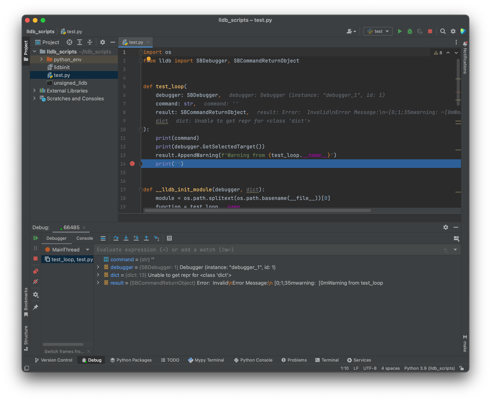
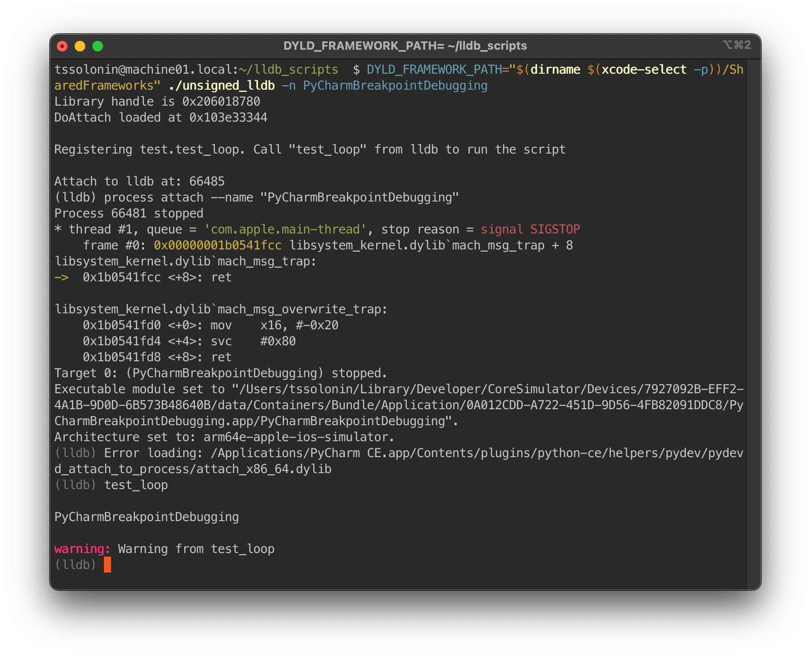
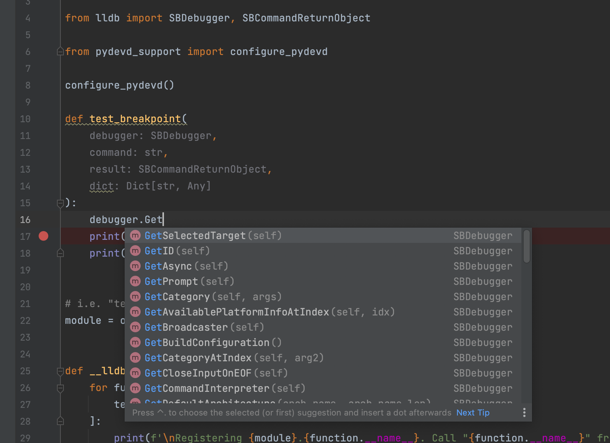

# Debug lldb Python scripts in PyCharm

This is the setup I use to work on lldb Python scripts [in PyCharm with debugging and code-completion](https://abdulowork.github.io/Debugging-lldb-Scripts-in-PyCharm):





First you will need a copy of lldb with an ad-hoc signature; otherwise, PyCharm won't be able to attach:
```bash
cp "$(xcrun -f lldb)" unsigned_lldb
codesign --force --sign - unsigned_lldb
```

Next you will need a virtual environment:
```bash
sh -c 'exec "$(xcode-select -p)"/Library/Frameworks/Python3.framework/Versions/Current/bin/python3 -m venv python_env'
```

Make a [script for lldb](test.py) and import it in [.lldbinit](.lldbinit). If you are on an arm64 macOS you will need to compile a custom `pydevd` shim because PyCharm only ships x86_64 binary. The source code for the shim is shipped with PyCharm:
```bash
cd "/Applications/PyCharm CE.app/Contents/plugins/python-ce/helpers/pydev/pydevd_attach_to_process/linux_and_mac"
g++ -fPIC -D_REENTRANT -std=c++11 -arch arm64 -c -o attach_arm64.o attach.cpp
g++ -dynamiclib -nostartfiles -arch arm64 -o attach_arm64.dylib attach_arm64.o -lc
```

and use `configure_pydevd()` from [pydevd_support.py](pydevd_support.py). 

Now run lldb:
```bash
DYLD_FRAMEWORK_PATH="$(dirname $(xcode-select -p))/SharedFrameworks" ./unsigned_lldb --local-lldbinit
```

Attach to the lldb process in PyCharm, set a breakpoint and run the command. PyCharm will break at a breakpoint, and you will be able to debug.

For completions support create a `pth` pointer to the lldb module:
```bash
echo "$(dirname $(xcode-select -p))"/SharedFrameworks/LLDB.framework/Versions/A/Resources/Python > "$(echo python_env/lib/python*)/site-packages/lldb.pth"
```

